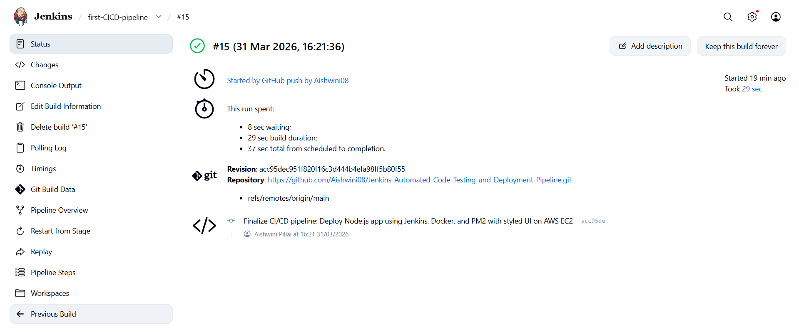
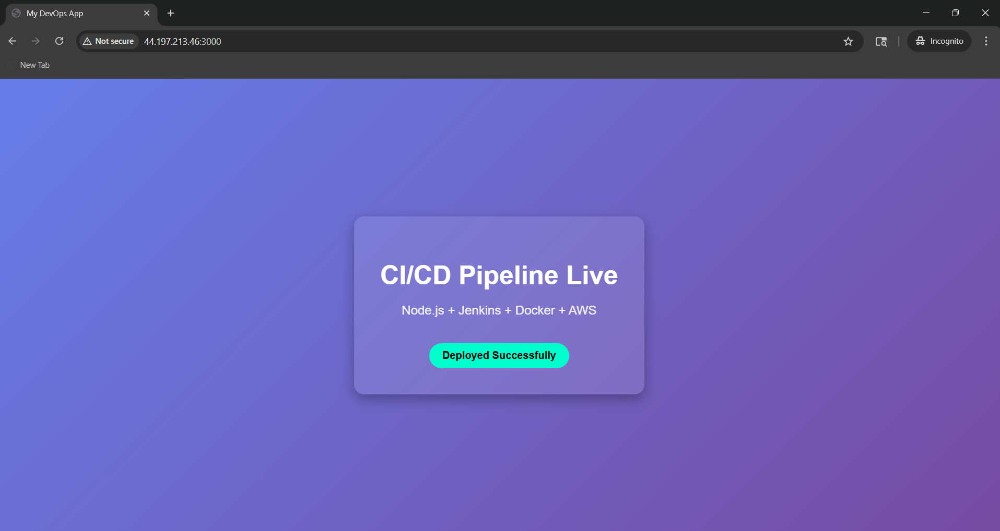
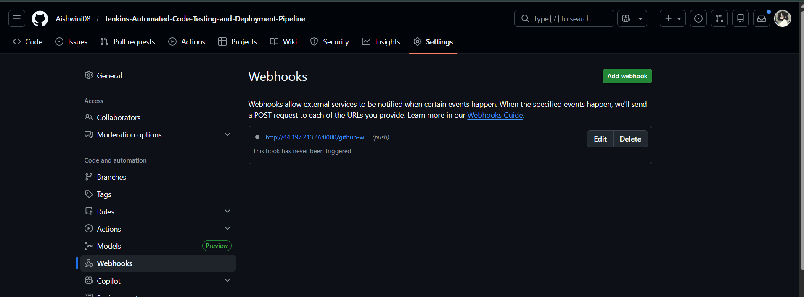

# 🚀 Jenkins CI/CD Pipeline with Docker & Node.js

---

## 📌 Project Overview

A complete end-to-end CI/CD pipeline using Jenkins to automate the build, test, and deployment of a Node.js application on AWS EC2 using Docker and PM2.

---

## 🧰 Tech Stack

- Node.js  
- Jenkins  
- Docker  
- PM2  
- AWS EC2  
- GitHub Webhooks  

---

## ⚙️ CI/CD Workflow

1. Developer pushes code to GitHub  
2. GitHub webhook triggers Jenkins  
3. Jenkins pulls the latest code  
4. Docker image is built  
5. Container is deployed on AWS EC2  
6. Application runs using PM2  

---

## ✨ Key Features

- Fully automated CI/CD pipeline  
- Dockerized Node.js application  
- Process management using PM2  
- Live deployment on AWS EC2  
- Auto-deploy on every code push  

---

## ⚠️ Challenges Faced

- Branch mismatch (master vs main)  
- GitHub webhook not triggering  
- Docker permission denied (`/var/run/docker.sock`)  
- Port 3000 already in use  
---

## ✅ Solutions Implemented

- Updated branch reference to `main`  
- Fixed webhook URL configuration  
- Opened port 8080 in AWS Security Group  
- Added Jenkins user to Docker group  
- Stopped existing containers before deployment  

---

## 🎯 Final Outcome

Successfully built a fully automated CI/CD pipeline where every push to GitHub triggers:

- Build  
- Deployment  
- Live update on AWS  

---

## 📷 Screenshots

### Jenkins Pipeline

---

### App Deployment

---

### Webhook

---

